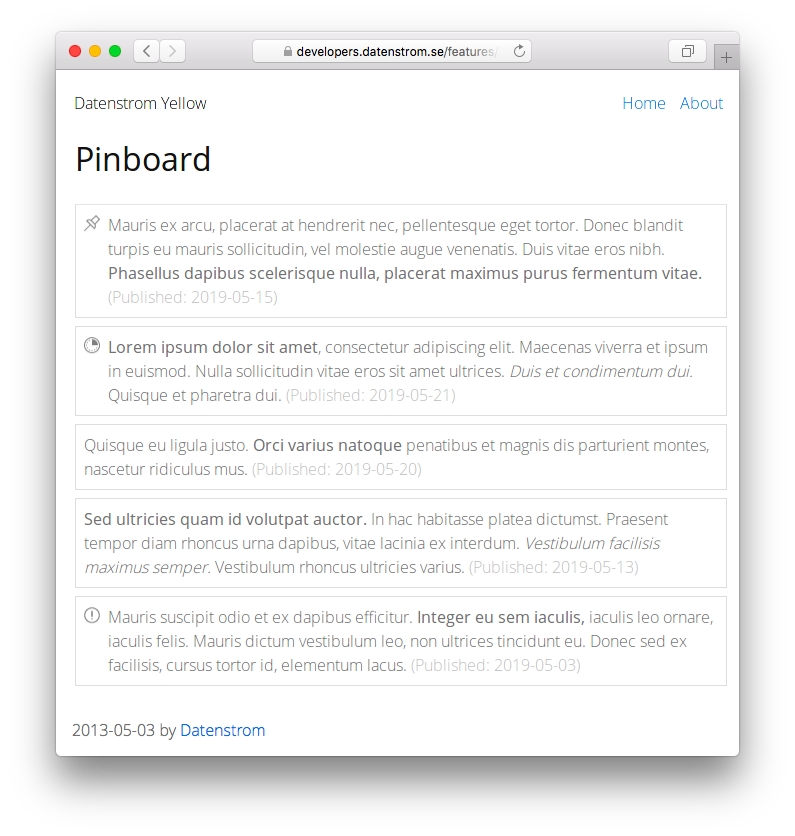

# Pinboard 0.9.1

Pinboard for timed notices.

## How to install an extension

[Download ZIP file](https://github.com/GiovanniSalmeri/yellow-pinboard/archive/refs/heads/main.zip) and copy it into your `system/extensions` folder. [Learn more about extensions](https://github.com/annaesvensson/yellow-update).

## How to show a pinboard

Create a `[pinboard]` shortcut.

The following arguments are available, all but the first argument are optional:

`Name` = file name of pinboard  
`TimeSpan` = `current` or `past`  
`Max` = number of notices to show per shortcut, 0 for unlimited  
`Tags` = tags of notices to show, wrap multiple tags into quotes  

If you want to customise the events with CSS, write a `pinboard-custom.css` file, put it into your `system/themes` folder, open file `system/extensions/yellow-system.ini` and change `PinboardStyle: custom`.

## How to create a pinboard

Put one or more pinboard files into `media/pinboard/`. You can use YAML, PSV, TSV and CSV format, choose whichever you like better.

Notices in a `.yaml` file (each notice begins with `---`):

    ---
    start: YYYY-MM-DD
    end: YYYY-MM-DD
    class: text
    content: text
    tags: tag tag...

Notices in a `.psv` file (one notice per line):

    YYYY-MM-DD | YYYY-MM-DD | class | content | tags

Notices can be written also in a `.tsv` or a `.csv` format (in this latter, content must be wrapped in quotes if it contains commas).

The `start` and `end` dates specify the time interval in which the notice is shown (end date is meant inclusive). The `class`, if present, is used to style the notice; notices classed as `pinned` are moreover listed at the top. The standard styles define the classes `important`, `urgent` and `pinned`: other classes can be freely added as needed.

In `content`, use `*` for italic, `**` for bold, `[text](URL)` for linking, `\n` for newline. Other URLs and email addresses are auto-linked.

## Examples

Content file with a pinboard:

    ---
    Title: Example page
    ---
    Lorem ipsum dolor sit amet, consectetur adipisicing elit, sed do eiusmod tempor incididunt ut 
    labore et dolore magna pizza. Ut enim ad minim veniam, quis nostrud exercitation ullamco laboris 
    nisi ut aliquip ex ea commodo consequat. Duis aute irure dolor in reprehenderit in voluptate velit 
    esse cillum dolore eu fugiat nulla pariatur. Excepteur sint occaecat cupidatat non proident, sunt 
    in culpa qui officia deserunt mollit anim id est laborum.

    [pinboard notices.psv]
    
Showing a pinboard, different files:

    [pinboard notices.psv]
    [pinboard notices.yaml]
    [pinboard notices.csv]

Showing a pinboard, various options:

    [pinboard notices.psv past]
    [pinboard notices.yaml current 5]
    [pinboard notices.yaml current 0 freetime]

## Settings

The following settings can be configured in file `system/extensions/yellow-system.ini`:

`PinboardDirectory` = directory for pinboard files  
`PinboardStyle` = pinboard style, e.g. `plain` and `icons` 

## Developer

Giovanni Salmeri. [Get help](https://datenstrom.se/yellow/help/).
